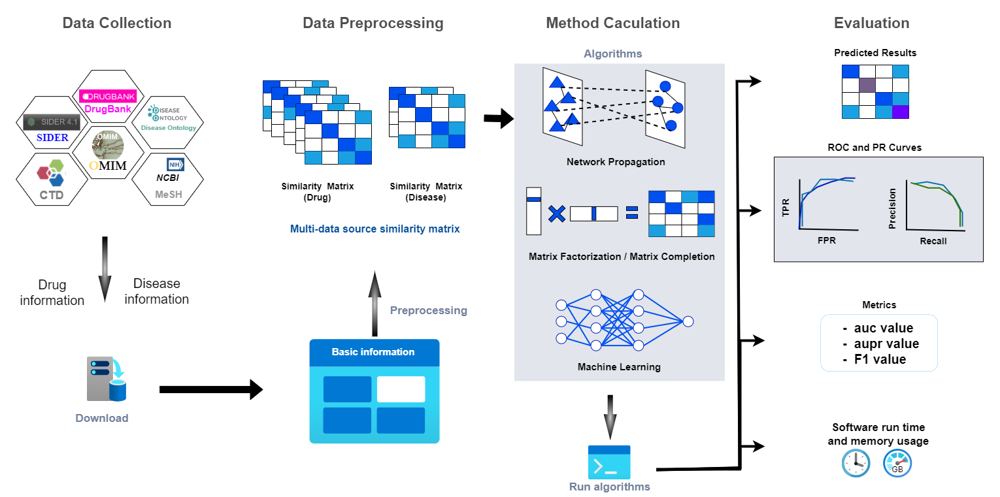

# DR-method-evaluation

Detailed evaluation results and web prediction tools are available at: [http://drugreposition.goodluckcome.com](http://drugreposition.goodluckcome.com).
## Requirements
Matlab 2020a

## Installation
Download by
~~~~
git clone https://github.com/yyq83/DR-method-evaluation.git
~~~~
and install dependencies by
~~~~~
conda env create -f environment.yaml
~~~~~

## Usage
Go to the Snakemake folder
~~~~
cd Snakemake
~~~~
If you only want to get the prediction results and scalability (time and memory peak consumption) of the method on the specified dataset, run the command(rule run_method_pre):
~~~~
snakemake -j 1 {outdir}/{method}_{dataset}.csv
~~~~
Example : BNNR method on Fdataset  
Command : `snakemake -j 1 Evaluation/BNNR_Fdataset.csv`  
Following the completion of the run, you'll discover the prediction results within the Evaluation folder. Additionally, you can access logs detailing time and memory consumption in their respective Benchmark and Log folders.
  
If you want to get the full results of the method on the specified dataset, including prediction results, scalability,performance,auc curve and aupr curve,run the command(rule evaluate): 
~~~~
snakemake -j 1 {outdir}/{method}/{dataset}/Plot/{method}_{dataset}_auc.png
~~~~
or
~~~~
snakemake -j 1 {outdir}/{method}/{dataset}/Plot/{method}_{dataset}_aupr.png  
~~~~
Example : BNNR method on Cdataset  
Command : `snakemake -j 1 Evaluation/BNNR/Cdataset/Plot/BNNR_Cdataset_auc.png`  
After completing the run, you can locate comprehensive results in the Evaluation folder. This encompasses prediction results, AUC curves, and AUPR curves found in the Plot folder, as well as AUC, AUPR, and F1 values stored in either the Benchmark folder or the Log folder.  

Users can add the command line parameter `--use-conda`, and snakemake will automatically create a running environment.
## Datasets 
The following datasets were used in our study：
`Fdataset`, `Cdataset`, `Ydataset`, `DNdataset`, `HDVD`, `LAGCN`, `LRSSL`, `SCMFDD_L`, `deepDR`, `iDrug`, `TLHGBI`, which is available at: [https://zenodo.org/record/8357512](https://zenodo.org/record/8357512).

## License

Copyright (c) 2023 yinqi yang

